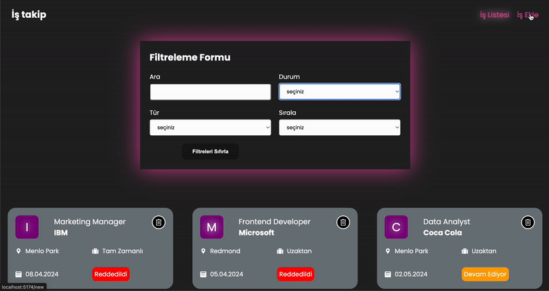
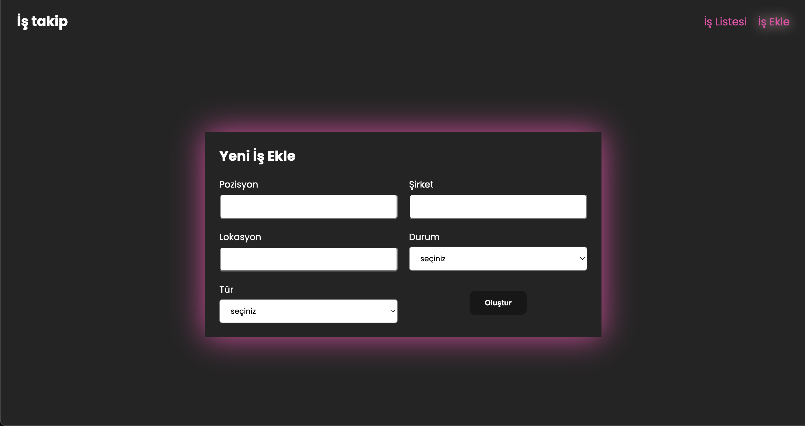
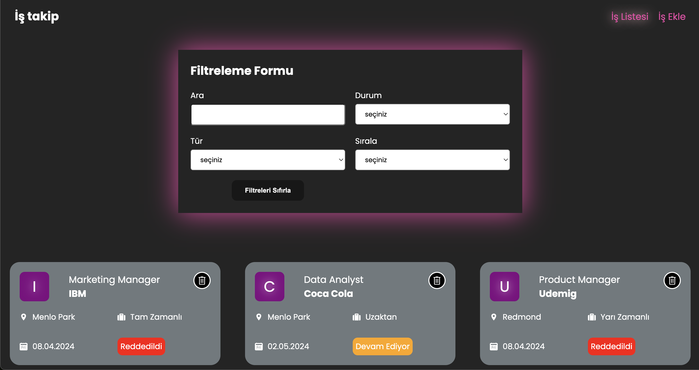

### Toolkit Job App


Toolkit Job App is a job tracking application designed to help users manage and track their job-related tasks efficiently. The application offers powerful filtering and search capabilities, allowing users to organize their jobs by various criteria.


<h2> Video gif</h2>



<h2>ScreenShoots</h2>

<h3> AddJob page </h3>



<h3> JobList page </h3>




## Table of Contents


- Description
- Features
- Technologies
- Installation
- Usage
- Contributing
- Contact


## Description

Toolkit Job App allows users to manage their job-related tasks effectively by providing features like job addition, filtering, and deletion. The primary focus of this application is to provide an easy-to-use interface for managing and organizing job information using Redux Toolkit for state management.

## Features

- Job Filtering: Filter jobs by name, status, type, and addition time (new to old, old to new).
- Job Addition: Add jobs with details such as company, location, type, and status.
- Job Deletion: Remove jobs with a delete button that includes a hover effect created with CSS.
- Search Functionality: Search for jobs by name for quick access.
- Data Management: Uses a JSON server for managing job data.

## Technologies 
The main technologies and libraries used in this project are:


- React
- Vite
- Redux and Redux-Thunk
- React Redux
- @reduxjs/toolkit
- React-select
- Axios
- SASS
- UUID
- React-toastify
- React-router-dom
- json -server
- react icons


 ##  Installation 

- Clone the project to your local machine:
git clone https://github.com/ozerbaykal/toolkit-job-app.git

- Navigate to the project directory:
```
cd toolkit-job-app
```
- Install the necessary packages:
```
npm install
```
### or
 ```
 yarn install
```

## Usage

- Start the development server:
```
npm run dev
```
### or
```
yarn dev
```

Visit http://localhost:3000 in your browser.

<h2>Contributing</h2>

Contributions are welcome! Please open an issue first to discuss what you would like to change.

- 1.Fork the project 
- 2.Create your feature branch (git checkout -b feature/NewFeature)
- 3.Commit your changes (git commit -m 'Add new feature')
- 4.Push to the branch (git push origin feature/NewFeature)
- 5.Open a Pull Request


<h2>Contact</h2>


Özer BAYKAL  mail : baykalozer87@gmail.com

Project Link: https://github.com/ozerbaykal/toolkit-job-app
